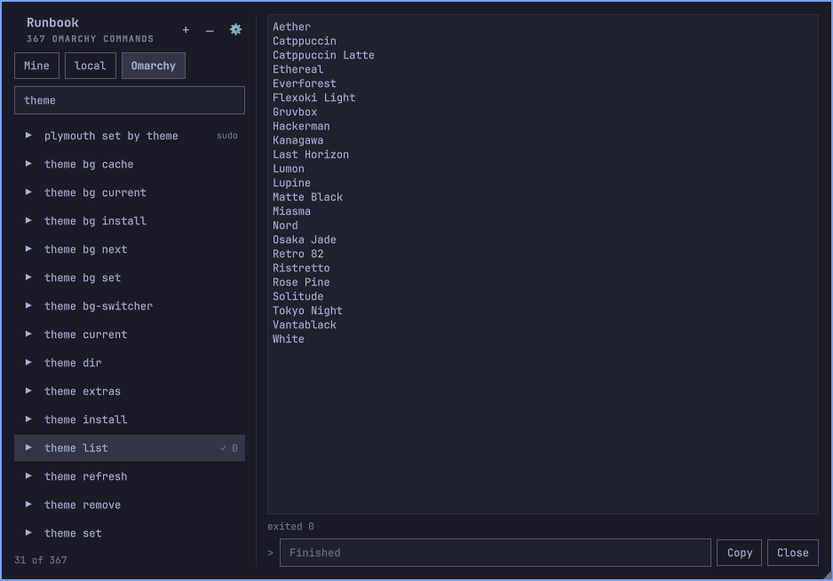

# Runbook

A bar plugin for [Omarchy](https://omarchy.org) that keeps the commands you
run now and then — each with a short help text — and runs them from the bar in
an embedded terminal. Schedule them to run on their own, and optionally pull in
commands you keep in Obsidian through the
[Readily](https://plugins.omarchy.org/plugin.html?id=io.github.ferc10110.readily)
plugin.



## What it does

- **Remembers the commands you always forget.** Paste the full command line,
  `sudo` and all, give it a name and a one-line reminder of what it does. Next
  time it is one click away instead of a search through your shell history.
- **Runs each one in its own terminal.** Press ▶ and the command runs in an
  embedded terminal you can read, type into (a password, a `y/n`) and copy
  from. Nothing else runs anything, so a stray click on a name is harmless.
- **Keeps them running in the background.** Commands survive closing the panel
  and restarting the shell — every terminal is a session of a private tmux
  server.
- **Schedules them.** Any command can run on its own every N minutes/hours/days
  or at a calendar time (daily, or weekly on the days you pick), through a
  systemd user timer.
- **Reads commands from Obsidian (optional).** Turn on the Readily integration
  and any note item you tag `#runbook` shows up in the list, ready to run and
  schedule — edited in Obsidian, read-only here.
- **Shows what Omarchy itself can do.** The Omarchy view lists every command
  Omarchy ships — updates, snapshots, firmware, hibernation, themes, restarts
  of Wi-Fi or Bluetooth — each with its description and examples, ready to
  search, run, or copy into your own list.

## Install

```bash
omarchy plugin add https://github.com/FerC10110/omarchy-runbook
omarchy plugin enable io.github.ferc10110.runbook --section left
```

Requires tmux 3.2 or newer (Omarchy ships 3.7). Move the icon with
`omarchy bar move io.github.ferc10110.runbook --section right`.

To remove it:

```bash
omarchy plugin disable io.github.ferc10110.runbook
omarchy plugin remove io.github.ferc10110.runbook
```

## Adding and running commands

Click the icon to open the panel and press `+` to add a command: a name, the
command line, and the help text you will want next time. Select a command to
read its help; press the small ▶ to run it. Your commands live in
`~/.config/runbook/scripts.json` (mode 600) and can be edited by hand — the
panel reloads the file when it changes.

Each running command has its own terminal. Type a line (a password, an answer)
and press Enter to send it. **Stop** interrupts the command and keeps its
output; **Close** discards the terminal. Select output with the mouse and press
**Copy** (or `c`) to copy it; with nothing selected, the whole screen is
copied. Drag the bottom-right corner to resize the panel; the size is
remembered.

Keys inside the panel: `j`/`k` or the arrows move the selection, `h`/`l` (or
← →) switch tabs, `J`/`K` (Shift) move the selected row — a command, a
separator or a Readily command — down/up, `H`/`L` (Shift) send it to the
previous/next tab, `x` deletes it (with
confirmation), `c` copies the terminal's selection or its whole output, `/`
searches Omarchy's commands, `Esc` closes the panel or cancels the form, `Tab`
switches to the next bar panel. Enter in the list never runs a command.

## Tabs and separators

**Tabs** group your commands: one for Docker, one for the servers you
maintain, and so on. Create, rename, reorder and delete them in the settings
(⚙). To send a command or a separator to another tab, pick the tab in its
**Edit** form, or press `H`/`L` (Shift) to carry it one tab left or right; it
lands at the end of that tab. The first tab you start with
can be renamed and moved but not deleted: deleting any other tab moves its
commands there, so nothing is ever lost with a tab.

**Separators** group related commands inside a tab. Press `―` in the header to
add one right below the selected command: a plain line, or a line with a label
centred on it (`──── docker ────`). Select it to edit its label, move it with
`J`/`K` or the ↑ ↓ buttons, or delete it. New commands also go right below the
selected one, so a group can be built in place.

## Omarchy's own commands

Omarchy ships a few hundred commands of its own (`omarchy commands` lists
them), and most people never find out they exist. Press the **Omarchy** tab —
or `/` — to browse them (turn the tab off in the settings if you do not want
it):

- **Search** by name or by what the command does: `snapshot`, `firmware`,
  `wifi`, `hibernation`. Enter or ↓ moves back to the list.
- **Read** the usage line, Omarchy's description, and its examples. Commands
  marked `sudo` ask for your password in the terminal.
- **Run** in the embedded terminal, like your own commands. If the command
  takes arguments, type them in the arguments line (Enter on the list jumps
  there, and Enter in it runs); click an example to fill it in. A command that
  needs arguments is never run without them.
- **Open in terminal** runs it in Omarchy's floating terminal instead — use it
  for commands that open a menu or a full-screen program, which the embedded
  terminal cannot show.
- **Add to my commands** copies it, with the arguments you typed and its help
  text, into your own list, where you can rename it and schedule it.

The list comes from `omarchy commands --json`, so it always matches your
installed Omarchy version; commands Omarchy marks as hidden are left out.

## Scheduling

When you add or edit a command you can schedule it to run automatically, either
every N minutes/hours/days or at a calendar time — daily, or weekly on one or
more days of the week. Runbook creates a systemd user timer
(`runbook-<id>.timer`) that runs the command on its own; open the panel to see
the last run's terminal.

- A scheduled `sudo` command waits at the password prompt until you open the
  panel and type it. Prefer NOPASSWD or non-sudo commands for unattended runs.
- User timers fire only while you are logged in, unless you run
  `loginctl enable-linger <user>`.
- `systemctl --user list-timers | grep runbook` shows what is scheduled.

## Integrate with Readily

Runbook can optionally show commands you keep in Obsidian through the **Readily**
plugin:

- Plugin page: <https://plugins.omarchy.org/plugin.html?id=io.github.ferc10110.readily>
- Source: <https://github.com/FerC10110/omarchy-readily>

Any Readily item tagged **`#runbook`** — in **any** note, whether the tag is on
the item itself or inherited from the note's frontmatter — appears in your
Runbook list, marked with a subtle ◆. They run and schedule just like your own
commands.

- **Edit in Obsidian.** A Readily command's name, text, and help are read-only
  in Runbook — change them in Obsidian and Runbook picks up the update next
  time you open the panel.
- **Place them where you want.** Move a Readily command up or down with
  `J`/`K` or the ↑ ↓ buttons, and send it to another tab from its **Edit**
  form or with `H`/`L`, like your own commands. Runbook keeps only its place in
  `scripts.json`; the command itself stays in Obsidian.
- **Turn it on.** Open the gear (⚙) in the Runbook panel header, toggle
  **"Integrate with Readily"**, and make sure Readily is installed and has its
  Obsidian folder set. If Readily is unavailable, the toggle stays inert with
  no errors.
- **Pick their tab.** With more than one tab, the settings let you choose the
  tab new Readily commands appear in. Once you move any row, the Readily
  commands you already have keep their place; move them one by one.
- **Auto-cleanup.** If you rename, move to another note, or delete a Readily
  command in Obsidian, its schedule and its place in Runbook are cleaned up
  automatically. Turning the integration off keeps their places for when you
  turn it back on.

## Notes

- Commands run in a non-interactive bash: no aliases and nothing from your
  `.bashrc`. `~/.local/bin` is added to `PATH`.
- The terminal shows plain text (no colours) and sends whole lines, so
  full-screen programs such as `htop` or `vim` are not usable inside it.
- The password you type for `sudo` goes straight to the terminal and is never
  stored.
- To reach a session from a real terminal: `tmux -L runbook attach -t <id>`
  (the id is in `scripts.json`) — while a client is attached, the pane follows
  that terminal's size instead of the panel's.

## Development

```bash
python3 -m unittest discover -s tests -v   # unit tests plus tmux end-to-end tests
omarchy plugin validate .
omarchy-restart-shell                       # QML changes need a shell restart
```

## License

MIT
